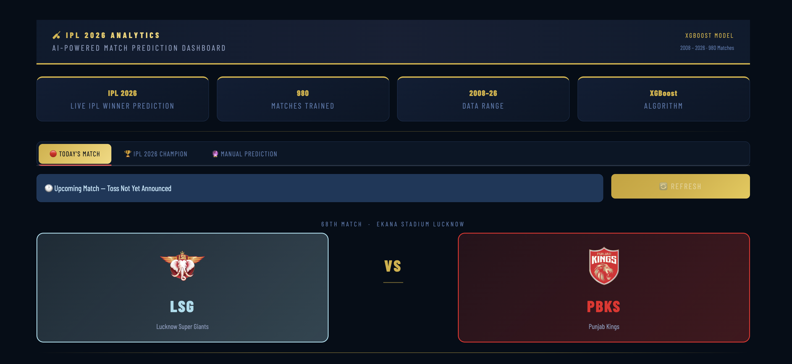
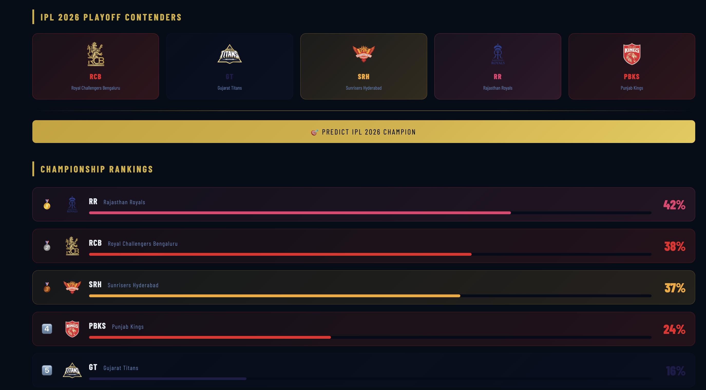
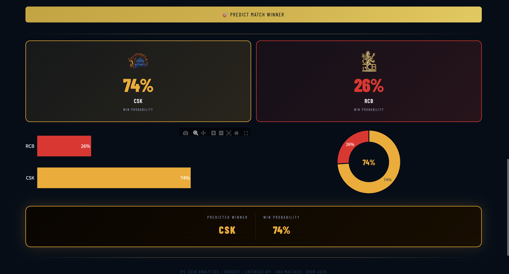

# 🏏 IPL 2026 Win Probability Predictor
### AI Powered Live Match Prediction Dashboard

[](https://ipl-winner-predictor-live.streamlit.app/)
[](https://python.org)
[](https://xgboost.readthedocs.io)
[](https://streamlit.io)

---

## Live demo

 **[Try the app live here](https://ipl-winner-predictor-live.streamlit.app/)**

---

## Demo Video


---

## 📸 Screenshots

| Today Match | Champion prediction | Manual prediction |
|---|---|---|
|  |  |  |

---

## What problem does this solve

Every IPL season, millions of fans want to know — *who is going to win today's match?*

Most prediction tools online are either
- Static (built once, never updated)
- Fake (just random numbers with no real ML behind them)
- Unavailable (paid or restricted)

This project solves all three problems. It is a **fully dynamic, ML-powered, publicly accessible** IPL win predictor that fetches live match data automatically and updates predictions in real time

---

## Features :-

### 🔴 Today's Match — Auto Live Prediction
- Automatically fetches today's IPL match from CricBuzz API
- Shows "pre-toss prediction" immediately when you open the app
- Updates to **post-toss prediction** the moment toss is announced
- Auto refreshes every 60 seconds during live matches
- Smart caching system — saves API calls by caching data intelligently

### 🏆 IPL 2026 Champion Prediction
- Simulates all possible playoff matchups using the trained ML model
- Shows championship probability for each of the playoff teams
- Ranked leaderboard with team logos and probability bars

### Manual Match Simulator :-
- Select any two IPL teams
- Choose toss winner and decision
- Get instant win probability with bar chart and donut chart
- Pre-toss prediction shown automatically without any input

---

## How I Built This Full Pipeline

This project covers the **complete data science lifecycle** from raw data to deployed product.

### Step 1 —>  Data Collection
- Downloaded IPL historical dataset from Kaggle (2008–2025) 919 matches
- Extracted all 63 IPL 2026 matches using CricBuzz API 61 completed matches
- Fetched toss data for every 2026 match individually via API
- Merged both datasets: **980 total matches**

### step 2 —> Data cleaning
- Standardised team names across 17 years of data
  - `Delhi Daredevils` → `Delhi Capitals`
  - `Kings XI Punjab` → `Punjab Kings`
  - `Royal Challengers Bangalore` → `Royal Challengers Bengaluru`
  - `Deccan Chargers` → `Sunrisers Hyderabad`
- Removed defunct franchises (Pune Warriors,Kochi Tuskers) not mapped to wrong teams
- Removed overseas venues (South Africa 2009, UAE 2020) — IPL now only plays in India
- Fixed 50+ duplicate stadium name variations across 17 years

### Step 3 Feature Engineering :-
Selected 4 features that are available **before** every match starts
- `team1` — batting first team
- `team2` — bowling first team
- `toss_winner` — which team won the toss
- `toss_decision` — bat or field

### step 4  Model Training & Selection
Trained and compared 4 models 

| Model | Train Accuracy | Test Accuracy | Gap |
|-------|---------------|---------------|-----|
| XGBoost (Final) | 67.47% | **58.16%** | 9.3% ✅ |
| XGBoost (Tuned RandomizedSearchCV) | 68.24% | 56.63% | 11.6% |
| Random Forest (tuned) | 64.29% | 53.57% | 10.7% |
| Logistic Regression | — | 22.45% | — |

**Why XGBoost with manual tuning won:**
GridSearch optimises for training data — not always best for test data. Manual tuning with regularisation gave the best generalisation

**Why 58% accuracy is Realistic:**
IPL match outcomes depend heavily on player form, pitch condition, weather, and injuries —> none of which are available before a match starts. Even professional fantasy platforms with much more data achieve only 60–65%. Our model achieves solid performance using only pre-match public information

### Step 5 — API integration
- Used **CricBuzz API via RapidAPI** for live match data
- Built smart caching system:
  - Live match → refresh every 30 minutes
  - Upcoming match → refresh every 1 hour
  - No match → refresh every 12 hours
- Total API usage: ~150–200 calls/month (well within 200/month free limit)

### Step 6 -> Deployment
- Built interactive dashboard with **Streamlit**
- Deployed on **Streamlit Cloud** free, public, always Live

---

## 📊 Model Evaluation

```
=== XGBoost Final Model ===

Training Data:
  Accuracy  : 67.47%
  Precision : 68.69%
  Recall    : 67.47%
  F1 Score  : 68.05%

Test Data:
  Accuracy  : 58.16%
  Precision : 58.40%
  Recall    : 58.16%
  F1 Score  : 57.10%

Overfitting Gap: 9.31% ✅ (Acceptable)
```

---

## Tech Stack :-

| Category | Technology |
|----------|-----------|
| Language | Python 3.12 |
| ML Model | XGBoost, Scikit-learn |
| Dashboard | Streamlit |
| Data Processing | Pandas, NumPy |
| Live Data | CricBuzz API (RapidAPI) |
| Model Saving | Joblib |
| Deployment | Streamlit Cloud |
| Version Control | Git + GitHub |

---

## 📁 Project Structure

```
ipl-win-predictor/
│
├── app.py                  # Main Streamlit Dashboard
├── data_fetcher.py         # Live API integration 
├── ipl_model.pkl           # Trained XGBoost model
├── encoders.pkl            # Label encoders for all features
├── match_cache.json        # Auto-generated cache file
├── requirements.txt        # All dependencies
└── README.md
```

---

> **Note:** You need a RapidAPI key for CricBuzz API. Get a free one at [rapidapi.com](https://rapidapi.com) and add it to `data_fetcher.py`

---

## 🔍 Key learnings :-

Building this project from scratch taught me things no tutorial covers:

- **Real APIs are messy** — CricBuzz had 50+ variations of the same stadium name across 17 years. Cleaning that took more time than training the model.
- **Overfitting is sneaky** — My first model showed 81% training accuracy and 57% test accuracy. GridSearch made it worse. Manual regularisation fixed it.
- **Free tier limits are real** — 200 API calls/month sounds like a lot until you test 63 match endpoints to get toss data. Built a caching system to stay within limits permanently.
- **Accuracy isn't everything** — 58% accuracy on predicting cricket match winners is genuinely good. Any higher would suggest data leakage.

---

## About me

I'm a data science student who built this project completely from scratch — data collection, cleaning, model training, API integration, frontend design, and deployment.

Email: [sourabh555@gmail.com](mailto:sourabh555@gmail.com)

LinkedIn: [linkedin.com/in/sourabh9098](https://www.linkedin.com/in/sourabh9098)

---

## Disclaimer

Predictions are based on historical match patterns and ML model outputs. They are for entertainment and educational purposes only — not betting advice. Model accuracy is 58% on test data.

---
If you found this project useful, please star the repository 
Built with during IPL 2026 season
